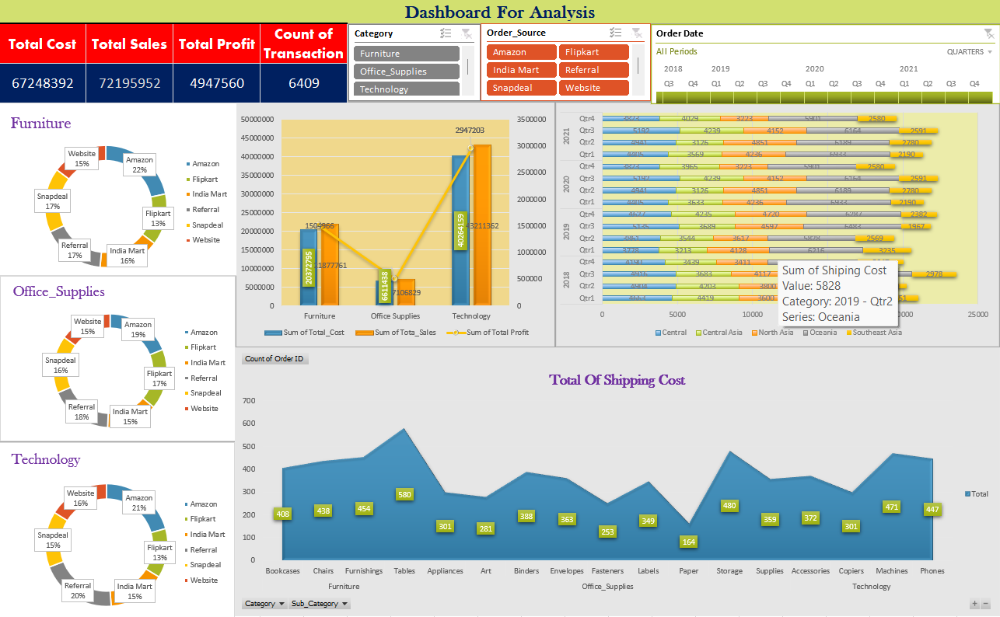

# Business-Intelligence-Dashboard
📊 Interactive Excel Business Intelligence Dashboard (Sales 2018–2021) 📈 Raw Data + Pivot Tables, Slicers, KPIs, Regional &amp; Platform Insights

# 📊 Business Intelligence Sales Dashboard  

## 🔎 Overview  
This repository presents an **interactive Excel Business Intelligence Dashboard** analyzing sales data from **2018–2021**.  
It combines both **raw data** and the **final dashboard** in a single `.xlsx` file, showcasing professional Excel BI and data analysis skills.  

The dashboard highlights **KPIs, category-wise trends, regional performance, shipping cost analysis, and platform insights** to support data-driven decision making.  

---

## ✨ Features  
- 📈 **Category-wise Analysis** (Furniture, Office Supplies, Technology)  
- 🌍 **Regional Sales Distribution** (Central, North, South, East, West)  
- 🚚 **Shipping Cost Optimization**  
- 🛒 **Order Source Tracking** (Amazon, Flipkart, Snapdeal, India Mart, etc.)  
- 📊 **Dynamic Charts & KPIs** (Sales, Cost, Profit, Transaction Count)  
- 🔎 **Interactive Filters & Slicers** (Category, Order Source, Date)  

---

## 💡 Key Insights  
- **Technology** → Highest profit margin  
- **Furniture** → Largest revenue contributor  
- **Office Supplies** → Consistent sales volume driver  
- **Central Region** → Strongest sales region  
- **Amazon & Flipkart** → Leading platforms by transaction volume  
- **15% profit improvement** identified through category analysis  

---

## 🛠️ Tools Used  
- **Microsoft Excel 2016+**  
  - Pivot Tables  
  - Pivot Charts  
  - Slicers  
  - Conditional Formatting  
  - Macros (for interactivity)  

---

## 🖼️ Dashboard Preview  
  

---

## 🚀 How to Use  
1. Download the repository (`Code → Download ZIP`) or clone it.  
2. Open **`Sales_Dashboard_with_RawData.xlsx`** in Microsoft Excel (2016 or later).  
3. Enable **Macros** for full interactivity.  
4. Explore the dashboard using **filters, slicers, and charts**.  

---

## 📌 Repository Structure  

Business-Intelligence-Dashboard/
│
├── data/                # Raw data & processed data
│   └── sales_data.xlsx
│
├── dashboard/           # Final dashboards
│   └── BI_Dashboard.xlsx
│
├── images/              # Screenshots for README
│   └── dashboard_preview.png
│
├── README.md            # Full project description
└── .gitignore
